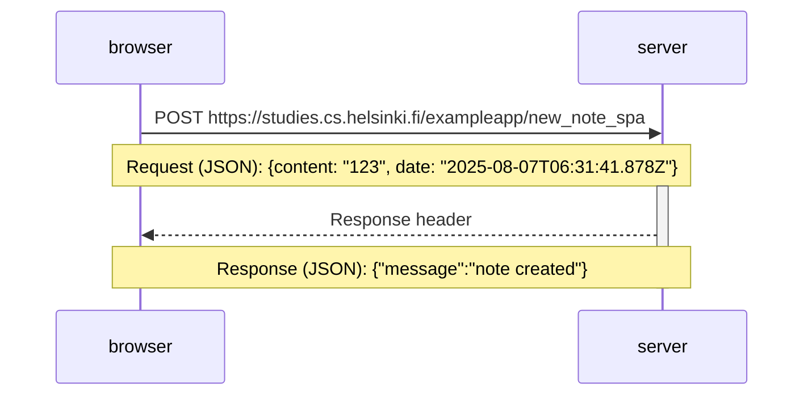

```mermaid
sequenceDiagram
    participant browser
    participant server

    browser->>server: POST https://studies.cs.helsinki.fi/exampleapp/new_note_spa
    Note over browser, server: Request (JSON): {content: "123", date: "2025-08-07T06:31:41.878Z"}
    activate server
    server-->>browser:  Response header
     Note over browser, server: Response (JSON): {"message":"note created"}
    deactivate server
  
   

```
